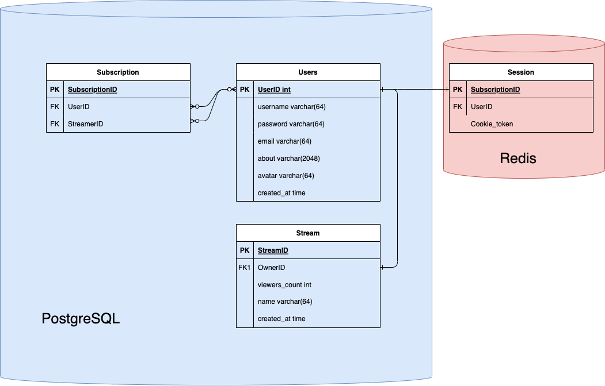

# Highload_Twitch

## 1. Тема и целевая аудитория
Twitch — видеостриминговый сервис, специализирующийся на тематике компьютерных игр, в том числе трансляциях геймплея и киберспортивных турниров.

### MVP 
- Регистрация аккаунтов пользователей (авторов трансляций и зрителей)
- Просмотр прямых трансляций пользователей
- Поиск и подбор идущих трансляций
- Чат трансляции
- Система подписок на каналы
- Подсчет количества зрителей, подписок

### Целевая аудитория ([статистика](https://www.demandsage.com/twitch-users/#:~:text=Key%20Twitch%20Statistics%20(2023)%20At%20A%20Glance&text=Twitch%20has%2031%20million%20daily%20active%20users%20(DAUs).))

По состоянию на январь 2023 года twitch ежемесячно посещают 140 миллионов уникальных пользователей.

Twitch имеет **31 миллион** активных пользователей в день (DAU).

Распределение трафика по странам в процентах:

- США - 20.46%

- Германия - 6.07%

- Корея - 5.32%

- Россия - 4.56%

- Франция - 4.27%   

### Рассчет нагрузки
#### Продуктовые метрики 
- Месячная аудитория - 140 млн
- Дневная аудитория - 31 млн
- Средний размер хранилища пользователя - отсутствует, так как хранение записей не предусмотрено
- Cреднее количество одновременно активных трансляции - 107тыс ([по данным на 2022 год](https://backlinko.com/twitch-users))

##### Среднее количество действий пользователей
Допустим, что в среднем в секунду отправляется 700 сообщений на основе [статистики](https://stats.streamelements.com/), тогда в день 60млн
| Тип запроса  | Среднее количество(млн/день)  |
|---|---|
| Авторизация               | 2 |
| Список подписок           | 2 |
| Поиск/подбор              | 7 |
| Отправка сообщения в чат  | 60 |
| Начало трансляции	        | 0.107 |

#### Технические метрики 
Просмотр стримов: одновременно смотрит стримы около 2.5млн человек [[2]](https://backlinko.com/twitch-users#twitch-statistics).

Потоковая передача видео: ежедневно загружается 2млн часов стримов [[3]](https://twitchtracker.com/statistics/stream-time).

Возьмем средний битрейт для качества 720p - 3000кбит/с
```
2 000 000 * 60 * 60 = 72 000 000 000 cекунд стримов в день
72 000 000 000сек * 3000кбит/с = 2.16 * 10^13 кбит = 2 574 920Гб/cутки ~ 2 600 000 Гб/сутки
```

##### Входящий трафик
| Тип запроса  | Объем одного запроса в Кб | Суточный объём (Гб/сутки)  | Пиковое потребление в течении суток (Гбит/с) |
|---|---|---|---|
| Авторизация               | 1 | 2 | 0.0001 |
| Отправка сообщения в чат  | 0.25 | 15 | 0.01 |
| Загрузка трансляции	    | - | 2 600 000 | 2000 |

##### Исходящий трафик
Ежедневно просматривается 61млн часов стримов [[4]](https://twitchtracker.com/statistics/watch-time)
```
61 000 000 * 60 * 60 = 219 600 000 000 cекунд стримов в день
219 600 000 000сек * 3000кбит/с = 6.588 * 10^14 ~ 78 500 000 Гб/сутки
```

В среднем в день запущено 107тыс стримов, а стримы смотрит 2.5 млн человек, пусть основная часть зрителей смотрит только четверть всех стримов, тогда среднее количество людей, пишуших в чат - 2 500 000 / (107 000 / 4) ~ 100. Значит суточный объем входящего трафика, влечет 100 кратный объем исходящего, т,к пользователь будет читать чат с 100 другими людьми.

```
15 * 100 = 1500 Гб
```

| Тип запроса  | Объем одного запроса в Кб | Суточный объём (Гб/сутки)  | Пиковое потребление в течении суток (Гбит/с) |
|---|---|---|---|
| Отправка сообщения в чат  | 0.25 | 1500 | 1 |
| Просмотр трансляции	    | - | 78 500 000  | 80000 |

##### Количество RPS по типам запросов
Авторизация:
```
2 000 000 авторизаций в день / 24 / 3600 ~ 25 RPS
```

Поиск/подбор:

```
7 000 000  / 24 / 3600 ~ 81 RPS
```

Отправка сообщений:
```
60 000 000 / 24 / 3600 ~ 700 RPS
```

Обновление счетчика количества зрителей на стриме(всего 107тыс в среднем стримов):

Обновляем раз в минуту
```
107 000 / 60 = 1800
```

| Тип запроса  | RPS  |
|---|---|
| Авторизация               | 25 |
| Список подписок           | 25 |
| Поиск/подбор              | 81 |
| Отправка сообщения в чат  | 700 |
| Количество зрителей на стриме	        | 1500 |


## 3. Логическая схема БД




## 4. Физическая схема БД
В качестве СУБД будем использовать PostgreSQL. Из того, что сервис подразумевает большее число чтений, нежели записи, будем использовать master/slave репликацию.

### Users
```
4*64 + 2048 + 4 + 8 = 2316 байт на одного пользователя
140 000 000 * 2316 = 3.2424 * 10^11 байт = = 0.294 Терабайт
```

### Subscription
```
4 + 4 + 4 = 12 байт на одну подписку
Допустим в среднем, один человек имеет 15 подписок, тогда 
140 000 000 * 15 * 12 = 25200000000 байт = 0,022 Терабайт
```

### Stream
Так как в MVP нет записи стримов, после окончания информация о стриме удаляется. Учитыва 107тыс активных трансляций:

```
4 + 4 + 4 + 64 + 8 = 84 байт на один стрим
107 000 * 84 = 8 988 000 байт = 8.5 Мегабайт
```

### Чат
Хранить чат каждого стрима является дорогостоющей операцией, т.к это огромная нагрузка на базу в виде большого числа операций записи, поэтому хранить историю сообщений нет необходимости, к тому же запись стрима не храниться.

Сообщения в чате будут реализованы через WS, следовательно 0 байт данных.

### Итог PostgreSQL
```
[0.294 Терабайт + 0.022 Терабайт + 0.000008 Терабайт] ~ 0.32 Терабайта данных
```

### Redis
Редис будет использоваться для хранения сессий пользователя и счетчика зрителей на стриме.
#### Сессии (id + кука)
Пусть ровно половина всех пользователей хоть раз заходит и обновляет куку
```
70 000 000 * (4 + 32) = 2 520 000 000 байт = 0.002 Терабайта
```
#### Счетчик (id стрима + количество)
```
107 000 * (4 + 4) = 856 000 байт ~ 1 Мб
```

## Источники
- https://www.demandsage.com/twitch-users/
- https://stats.streamelements.com/
- https://backlinko.com/twitch-users#twitch-statistics
- https://twitchtracker.com/statistics