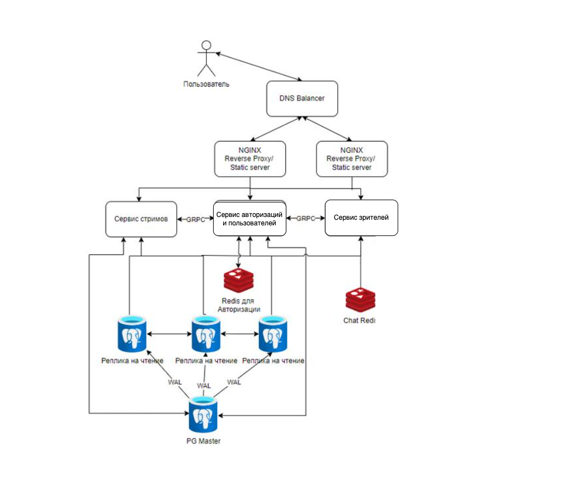
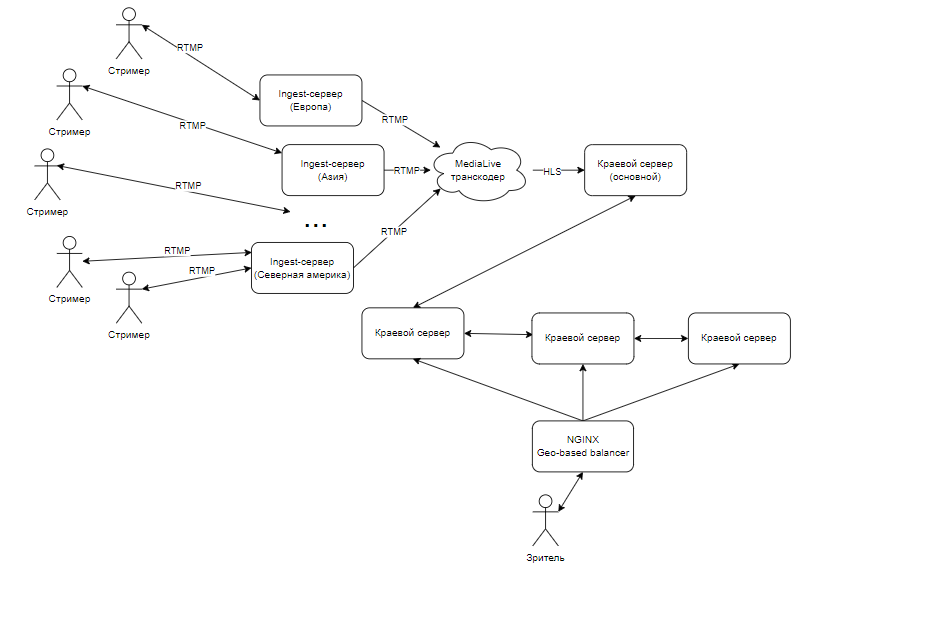

# Highload_Twitch

## 1. Тема и целевая аудитория
Twitch — видеостриминговый сервис, специализирующийся на тематике компьютерных игр, в том числе трансляциях геймплея и киберспортивных турниров.

### MVP 
- Регистрация аккаунтов пользователей (авторов трансляций и зрителей)
- Просмотр прямых трансляций пользователей
- Поиск и подбор идущих трансляций
- Чат трансляции
- Система подписок на каналы
- Подсчет количества зрителей, подписок

### Целевая аудитория ([статистика](https://www.demandsage.com/twitch-users/#:~:text=Key%20Twitch%20Statistics%20(2023)%20At%20A%20Glance&text=Twitch%20has%2031%20million%20daily%20active%20users%20(DAUs).))

По состоянию на январь 2023 года twitch ежемесячно посещают 140 миллионов уникальных пользователей.

Twitch имеет 31 миллион активных пользователей в день (DAU).

Распределение трафика по странам в процентах:

- США - 20.46%

- Германия - 6.07%

- Корея - 5.32%

- Россия - 4.56%

- Франция - 4.27%   

### Рассчет нагрузки
#### Продуктовые метрики 
- Месячная аудитория - 140 млн
- Дневная аудитория - 31 млн
- Средний размер хранилища пользователя - отсутствует, так как хранение записей не предусмотрено
- Cреднее количество одновременно активных трансляции - 107тыс ([по данным на 2022 год](https://backlinko.com/twitch-users))

##### Среднее количество действий пользователей
Допустим, что в среднем в секунду отправляется 700 сообщений на основе [статистики](https://stats.streamelements.com/), тогда в день 60млн
| Тип запроса  | Среднее количество(млн/день)  |
|---|---|
| Авторизация               | 2 |
| Список подписок           | 2 |
| Поиск/подбор              | 7 |
| Отправка сообщения в чат  | 60 |
| Начало трансляции	        | 1 |
| Cтраница стримера	        | 7 |

#### Технические метрики 
Просмотр стримов: одновременно смотрит стримы около 2.5млн человек [[2]](https://backlinko.com/twitch-users#twitch-statistics).

Потоковая передача видео: ежедневно загружается 2млн часов стримов [[3]](https://twitchtracker.com/statistics/stream-time).

Возьмем средний битрейт для качества 720p - 3000кбит/с
```
2 000 000 * 60 * 60 = 72 000 000 000 cекунд стримов в день
72 000 000 000сек * 3000кбит/с = 2.16 * 10^13 кбит = 2 574 920Гб/cутки ~ 2 600 000 Гб/сутки

# Пусть 80% от суточного трафика сконцетрировано на вечер 17-21 тогда пиковое потребление:
2 600 000 * 8 * 0.8 / (4 * 3600) = 1155 Гбит/с
```

Страница стримера: шапка, аватар, инофрмация, банеры и тд. Оценим в 2000Кбайт

##### Входящий трафик
| Тип запроса  | Объем одного запроса в Кб | Суточный объём (Гб/сутки)  | Пиковое потребление в течении суток (Гбит/с) |
|---|---|---|---|
| Авторизация               | 1 | 2 | 0.0008 |
| Отправка сообщения в чат  | 0.25 | 15 | 0.01 |
| Загрузка трансляции	    | - | 2 600 000 | 1155 |

##### Исходящий трафик
Ежедневно просматривается 61млн часов стримов [[4]](https://twitchtracker.com/statistics/watch-time)
```
61 000 000 * 60 * 60 = 219 600 000 000 cекунд стримов в день
219 600 000 000сек * 3000кбит/с = 6.588 * 10^14 ~ 78 500 000 Гб/сутки
```

В среднем в день запущено 107тыс стримов, а стримы смотрит 2.5 млн человек, пусть основная часть зрителей смотрит только четверть всех стримов, тогда среднее количество людей, пишуших в чат - 2 500 000 / (107 000 / 4) ~ 100. Значит суточный объем входящего трафика, влечет 100 кратный объем исходящего, т,к пользователь будет читать чат с 100 другими людьми.

```
15 * 100 = 1500 Гб
```

Пусть 80% от суточного трафика приходятся на  вечер с 17 до 21, тогда трафик в пиковые часы:
```
7 * 8 * 0.8 / (4 * 3600) = 0.003 Гбит/с - страница стримера
78 500 000 * 8 * 0.8 / (4 * 3600) = 35 000 Гбит/c - просмотр стрима
1500 * 8 * 0.8 / (4 * 3600) = 0.6 Гбит/c - сообщения
```

| Тип запроса  | Объем одного запроса в Кб | Суточный объём (Гб/сутки)  | Пиковое потребление в течении суток (Гбит/с) |
|---|---|---|---|
| Отправка сообщения в чат  | 0.25 | 1500 | 0.6 |
| Просмотр трансляции	    | - | 78 500 000  | 35 000 |
| Страница стримера	    | 2000 | 7  | 0.003 |

##### Количество RPS по типам запросов
Авторизация:
```
2 000 000 авторизаций в день / 24 / 3600 ~ 25 RPS
```

Поиск/подбор:

```
7 000 000  / 24 / 3600 ~ 81 RPS
```

Отправка сообщений:
```
60 000 000 / 24 / 3600 ~ 700 RPS
```


Начало просмотра стрима:

Т.к поиск и подбор составляет в среднем 7 млн запросов в день, пусть 95% всех поисков/подборов успешны и пользователь все таки решается зайти на стрим, тогда:
```
7 000 000 * 0.95 / 24 / 3600 = 76 RPS
```

Страница стримера:
```
7 000 000 / 24 / 3600 = 80
```

| Тип запроса  | RPS  |
|---|---|
| Авторизация               | 25 |
| Список подписок           | 25 |
| Поиск/подбор              | 81 |
| Отправка сообщения в чат  | 700 |
| Начало просмотра стрима	        | 76 |
| Cтраница стримера	        | 80 |


## 3. Логическая схема БД


## 4. Физическая схема БД
В качестве СУБД будем использовать PostgreSQL. Из того, что сервис подразумевает большее число чтений, нежели записи, будем использовать master/slave репликацию.

### Users
```
4*64 + 2048 + 4 + 8 = 2316 байт на одного пользователя
140 000 000 * 2316 = 3.2424 * 10^11 байт = = 0.294 Терабайт
```

### Subscription
```
4 + 4 + 4 = 12 байт на одну подписку
Допустим в среднем, один человек имеет 15 подписок, тогда 
140 000 000 * 15 * 12 = 25200000000 байт = 0,022 Терабайт
```

### Stream
Так как в MVP нет записи стримов, после окончания информация о стриме удаляется. Учитыва 107тыс активных трансляций:

```
4 + 4 + 4 + 64 + 8 = 84 байт на один стрим
107 000 * 84 = 8 988 000 байт = 8.5 Мегабайт
```

### Чат
Хранить чат каждого стрима является дорогостоющей операцией, т.к это огромная нагрузка на базу в виде большого числа операций записи, поэтому хранить историю сообщений нет необходимости, к тому же запись стрима не храниться.

Сообщения в чате будут реализованы через WS, следовательно 0 байт данных.

### Итог PostgreSQL
```
[0.294 Терабайт + 0.022 Терабайт + 0.000008 Терабайт] ~ 0.32 Терабайта данных
```

### Redis
Редис будет использоваться для хранения сессий пользователя и счетчика зрителей на стриме.
#### Сессии (id + кука)
Пусть ровно половина всех пользователей хоть раз заходит и обновляет куку
```
70 000 000 * (4 + 32) = 2 520 000 000 байт = 0.002 Терабайта
```
#### Счетчик (id стрима + количество)
```
107 000 * (4 + 4) = 856 000 байт ~ 1 Мб
```

### Nginx RTMP
Т.к в сутки загружается в среднем видео на 2 600 000 Гб на 1 млн трансляций, а одновременных трансляций в среднем 0.107млн следовательно будет достаточно объема в 2.5 Петабайт

## 5. Технологии

| Технология              | Применение                                                   | Причина выбора                                               |
| ----------------------- | ------------------------------------------------------------ | ------------------------------------------------------------ |
| PostgreSQL                 | База данных                                                  | Простота использования, совместимость с Golang, сравнительно легкая расширяемость |
| TypeScript              | Язык используемый для написание фронтенда. Поддержка HLS для стримов в браузере | Типизация, ошибки при компиляции                             |
| React                   | Фреймворк для написания клиентской части.                    | Скорость написания, реактивность интерфейса, высокая популярность |
| Nginx                   | Веб-сервер для отдачи статики, обратное прокси               | Производительность, простота настройки                       |
| AWS Elemental MediaLive | Преобразование RTMP потока стримера в HLS потоки разного качества и различного FPS | Удобство настройки, скорость работы, работа с другими медиасервисами AWS, совместимость с OBS(популярная программа у стримеров для захвата экрана)           |
| Nginx RTMP | модуль потоковой передачи медиа данных | Надежность, произовдительность
| Golang                  | Язык backend                                                 | Скорость написания, скорость работы, простота поддержки, популярность |
| RedisDB                 | База данных                                                  | Высокая скорость из-за нахождения данных в оперативной памяти. Простота использования, совместимость с Golang |


## 6. Схема проекта

Для балансировки применяется DNS балансировка, затем L7-балансировка на NGINX.

Сервис делится на несколько микросервисов

Сервис стримов - сервис для работы с данными о стримах, здесь добавляются и раздаются Stream-keys и ссылки на HLS потоки, также осуществляется работа с подборками активных стримов

Сервис зрителей - учитывая расчеты, самый нагруженный по RPS сервис, подлежащий масштабированию при необходимости. Разместить подсчет количества зрителей на стриме и чаты рядом крайне удобно, так как каждый участник чата стрима в свою очередь является и зрителем.

Сервис авторизации и пользователей - сервис обрабатывающий запросы на авторизацию и работающий с данными пользователя.

Препологается, что все микросервисы будут написаны на GO и будут при необходимости общаться между собой по gRPC, что обеспечивает высокую скорость обмена данными между внутренними API сервиса.

Записи, как уже отмечалось ранее, происходят намного реже,чем чтение, соответсвенно следует использовать реплики на чтение данных из PostgreSQL. Следует использовать синхронную репликацию, при которой данные записываются сначала в WAL как минимум одной реплики, после чего исполняются в мастере. При такой схеме необходимо минимум 2 реплики БД, однако вероятность потери данных минимизируется и скорость чтения увеличивается.

JS-клиент и статические файлы раздаются NGINX, который также проксирует запросы на сами микросервисы.

### Организация получения и раздачи стримов



При создании стрима на сайте, стример получает ссылку со Stream-KEY для последующего ведения трансляции через OBS Studio или его аналоги, отправляющие RTMP поток на Ingest-сервер, который проверяет ключ стрима и перенаправляет его RTMP-поток в существующий транскодер или создает новый при отсутсвии свободных. Сгенерированные уже HLS-потоки отправляются на краевой (Edge) сервер, далее по цепочке Edge сервера при необходимости забирают и ретранслируют поток ближе к зрителю.

Допустим у нас есть стрим из США, который хотят смотреть пользователи из России, в таком случае Российский edge сервер однократно будет забирать поток и ретранслировать его русским зрителям и все русские зрители будут обращаться к нему, что ускорит загрузку контента и уменьшит нагрузку на другой edge-сервер.

Зритель в свою очередь изначально обращается к балансировщику, который по IP-адресу может приблизительно понять его местоположение и направить на оптимальный краевой сервер.

## 7. Список серверов
Как вычислялось ранее - выходящего трафика на просмотр стримов - 35 000гбит в случае пиковой нагрузки. При использовании 40гбит-ных сетевых карт потребуется около.
```
35000/40 = 875
```
Зная, что максимально активными одновременно может быть 107 000 стримов, задачей edge сервера является хранение последних 10 секунд стрима для последующей передачи стрима в 6 разных качествах со средним битрейтом 3000 кбит/с
```
3000 * 6 = 18 мб
18 * 10 = 180 мб
180 * 107 000 = 18,3 тб
18,3 / 875 = 21 гб ОЗУ

```

Таким образом каждый edge сервер должен обладать минимум 21 гб ОЗУ, зная стандарты размеров оперативной памяти удобно использовать 4 x 6 = 24 гб озу.

Объем диска в edge серверах не имеет особого значения, можно использовать SSD на 50 гбайт.

875 edge серверов

Западаное побережье США - 15% edge-серверов (131)
Восточное побережье США - 15% edge-серверов (131)
Германия (Frankfurt) - 10% edge-серверов (87)
Корея - 10% edge-серверов (87)
Бразилия - 10% edge-серверов (87)
Россия - 10% edge-серверов (87)
ЮАР - 5% edge-серверов (44)
Канада - 5% edge-серверов (43)
Франция - 5% edge-серверов (43)
Англия - 5% edge-серверов (43)
Турция - 5% edge-серверов (43)
Испания - 5% edge-серверов (43)
Австралия - 5% edge-серверов (43)

### Конфигурация edge-сервера
CPU | RAM (Гб) | Тип диска | Объем диска (Гб) | Пропускная способность (Гб/с)
--- | -------- | --------- | ---------------- | -----------------------------
8   | 24       | SSD       |   50             | 40  


Входящего трафика в пиковой нагрузке 2000гб.
При использовании тех же сетевых карт

```
1115 / 40 = 28
```

На Ingest сервер приходит один поток максимально высокого качества RTMP стрима.

### Конфигурация ingest-сервера
CPU | RAM (Гб) | Тип диска | Объем диска (Гб) | Пропускная способность (Гб/с)
--- | -------- | --------- | ---------------- | -----------------------------
4   | 12       | SSD       |   50             | 40  


### Конфигурация nginx-сервера
CPU | RAM (Гб) | Тип диска | Объем диска (Гб) | Пропускная способность (Гб/с)
--- | -------- | --------- | ---------------- | -----------------------------
16   | 32       | SSD       |   120             | 20

### Конфигурация backend-сервера
CPU | RAM (Гб) | Тип диска | Объем диска (Гб) | Пропускная способность (Гб/с)
--- | -------- | --------- | ---------------- | -----------------------------
64   | 24       | SSD       |   50             | 20  

### Конфигурация бд-сервера
CPU | RAM (Гб) | Тип диска     | Объем диска (Гб) | Пропускная способность (Гб/с)
--- | -------- | ---------     | ---------------- | -----------------------------
16   | 12       | SSD+HDD       |   120+1000       | 20  

Таким образом разделим все сервера по 10 регионам датацентрам (для каждых 5% edge-серверов)

* Западаное побережье США - 3 датацентра
* Восточное побережье США - 3 датацентра
* Германия - 2 датацентра
* Корея - 2 датацентра
* Бразилия - 2 датацентра
* Россия - 2 датацентра
* ЮАР - 1 датацентр
* Канада -  1 датацентр
* Франция -  1 датацентр
* Англия -  1 датацентр
* Турция -  1 датацентр
* Испания - 1 датацентр
* Австралия -  1 датацентр


Тогда в одном датацентре

**Количество серверов на датацентр**
Тип      | Количество основных | Количество всего
-------- | ------------------- | --------------------
Nginx    |  12                   | 240
Backend  | 6                     | 120
Database | 12                   |  240
Ingest   |  10                   |  28
Edge*     |  40                   | 875

Edge сервера находятся в непосредственных городах отдельно от датацентра, максимально близко к потребителям контента


## Источники
- https://www.demandsage.com/twitch-users/
- https://stats.streamelements.com/
- https://backlinko.com/twitch-users#twitch-statistics
- https://twitchtracker.com/statistics
